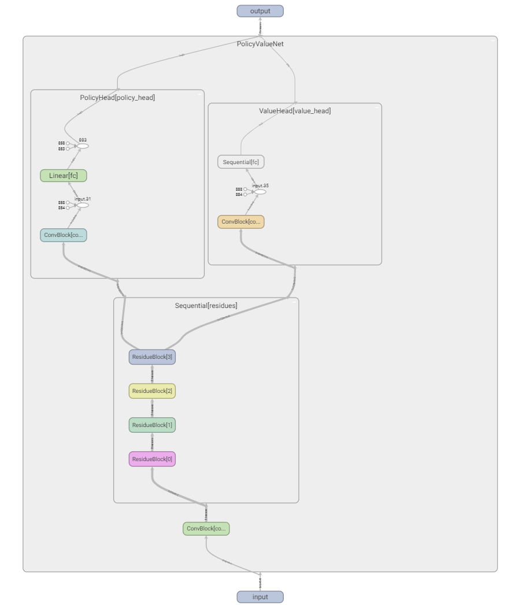

<p align="center">
  
</p>
  <h1 align="center">
  Alpha Gobang Zero
</h1>

<p align="center">
  A gobang robot based on reinforcement learning
</p>

<p align="center">
  <a style="text-decoration:none">
    
  </a>

  <a style="text-decoration:none">
    
  </a>

  <a style="text-decoration:none">
    
  </a>

  <a style="text-decoration:none">
    
  </a>

  <a style="text-decoration:none">
    
  </a>
</p>

<div align="center">

</div>


## Policy-Value Net
* Network structure
  * `ConvBlock` × 1
  * `ResidueBlock` × 4
  * `PolicyHead` × 1
  * `ValueHead` × 1
* Network visualization
<div align="center">

</div>

## Quick start
1. Create virtual environment:

    ```shell
    conda create -n Alpha_Gobang_Zero python=3.8
    conda activate Alpha_Gobang_Zero
    pip install -r requirements.txt
    ```

2. Install `PyTorch`，refer to the [blog](https://www.cnblogs.com/zhiyiYo/p/15865454.html) for details；


3. Start game:

    ```shell
    conda activate Alpha_Gobang_Zero
    python game.py
    ```

## Train model


  ```shell
  conda activate Alpha_Gobang_Zero
  python train.py
  ```


## Blog
[《如何使用自对弈强化学习训练一个五子棋机器人Alpha Gobang Zero》](https://www.cnblogs.com/zhiyiYo/p/14683450.html)

## Reference
* [《Mastering the game of Go without human knowledge》](https://www.nature.com/articles/nature24270.epdf?author_access_token=VJXbVjaSHxFoctQQ4p2k4tRgN0jAjWel9jnR3ZoTv0PVW4gB86EEpGqTRDtpIz-2rmo8-KG06gqVobU5NSCFeHILHcVFUeMsbvwS-lxjqQGg98faovwjxeTUgZAUMnRQ)
* [《Mastering Chess and Shogi by Self-Play with a General Reinforcement Learning Algorithm》](https://arxiv.org/abs/1712.01815)


## FAQs
* **Why does the window get stuck when it is dragged?**

  Because the interface background uses acrylic effect, this problem will occur for some versions of win10. There are three solutions:

  * Upgrade win10 to the latest version.
  * Uncheck the check box of **Advanced system settings --> Performance --> Show window contents when dragging**.
  * Turn off the option to enable acrylic background in the setting interface.

* **Why does the configuration I modified in the settings interface not take effect immediately?**

  The modified configuration will take effect at the beginning of the next game.


## License
Alpha-Gobang-Zero is licensed under [GPLv3](./LICENSE).

Copyright © 2021 by zhiyiYo.
